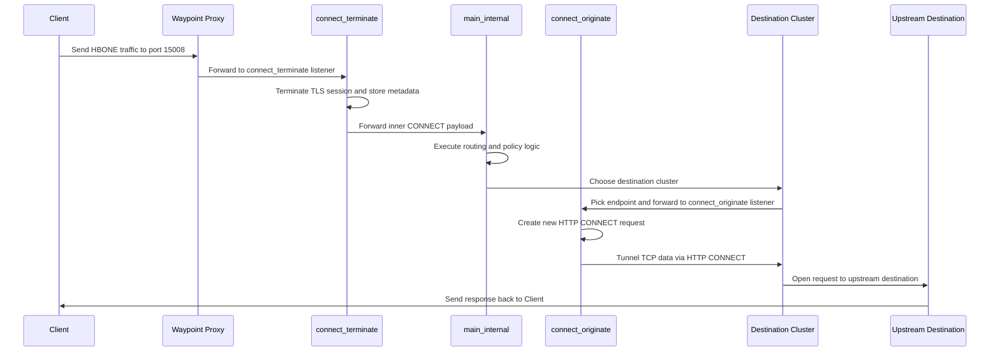

# Waypoints

```mermaid
 sequenceDiagram
    participant Client
    participant Waypoint Proxy
    participant connect_terminate
    participant main_internal
    participant connect_originate
    participant Destination Cluster
    participant Upstream Destination

    Client->>Waypoint Proxy: Send HBONE traffic to port 15008
    Waypoint Proxy->>connect_terminate: Forward to connect_terminate listener
    connect_terminate->>connect_terminate: Terminate TLS session and store metadata
    connect_terminate->>main_internal: Forward inner CONNECT payload
    main_internal->>main_internal: Execute routing and policy logic
    main_internal->>Destination Cluster: Choose destination cluster
    Destination Cluster->>connect_originate: Pick endpoint and forward to connect_originate listener
    connect_originate->>connect_originate: Create new HTTP CONNECT request
    connect_originate->>Destination Cluster: Tunnel TCP data via HTTP CONNECT
    Destination Cluster->>Upstream Destination: Open request to upstream destination
    Upstream Destination->>Client: Send response back to Client
```
